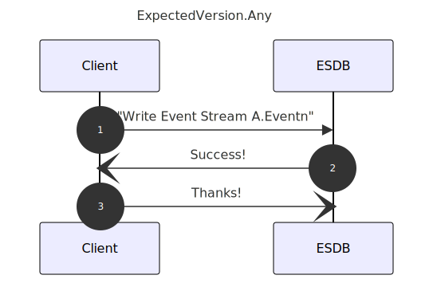
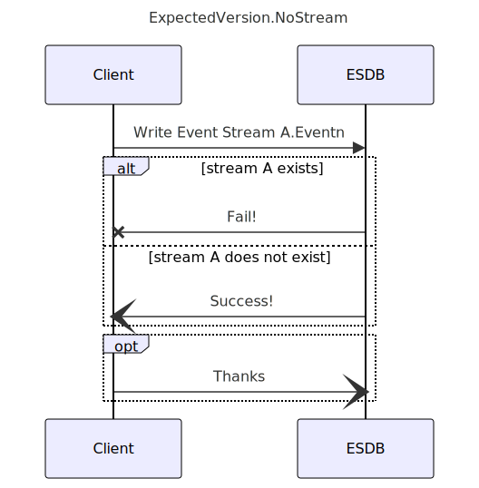
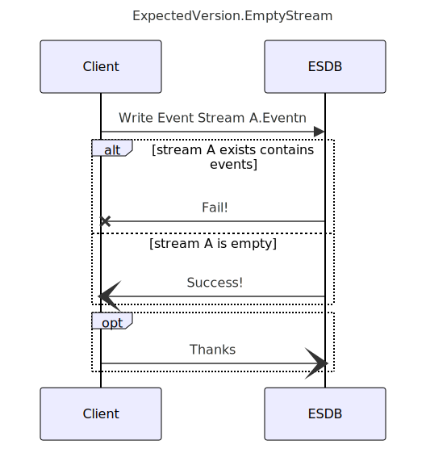
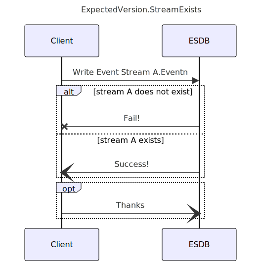
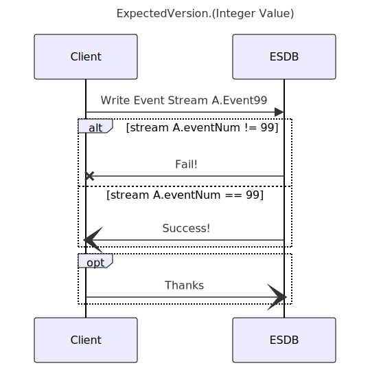

<!-- color: white -->
<!-- The color directive will be inherited
Probably need to learn how to set it globally and override it
locally
 -->
<!-- paginate: true -->
<!-- paginate adds slide numbers, we start on the second -->
# Concurrency 

EventStoreDB supports an Optimistic Concurrency Check on appends. 

This Module will demonstrate the available features

---

<!-- backgroundImage: url('./resources/Lab_background.png') -->
<!-- color: black -->

# Optimistic Concurrency Defined

Instead of locking first in order to guarantee success of a transaction, OCC assume success (that is the optimistic part) and fails the transaction if a conflict is detected.

---

# When are the Concurrency checks made?

The concurrency check is defined on the write of an event. If the concurrency check fails then the write of that event fails.

---
# Note to FTS staff, 

I could use some help with verbage.
* When are they needed?
* Why is this needed?
* How it differs from Database (I can handle this, just need to add some words)
* How to recognize when you are doing it wrong?
* What it looks like when you are doing it right?

---

# How to Provide Feedback

I will open up the following questions in slack

Please open a thread for responses. 
Importance, use-when, how to know when this is used correctly/incorrectly
Any concise summary of feature that you would use

1. Use of ID unique check before disk write on server
2. Any
3. No Stream
4. Yes Stream
5. Version # 

---
# Available Settings

* ExpectedVersion.Any / StreamState.Any
   * Disables concurrency Check
* ExpectedVersion.NoStream /StreamState.No_Stream
  * Stream Does Not Exist Yet

---
# Options continued..  
* ExpectedVerstion.streamExists/StreamState.Exists
    * Stream Exists, Event number not checked
* Any Integer Value
    * Must be that Event Number

---
# Event ID

Although not specifically a concurrency check, you should be aware that 
* Event Ids are a string, unique over the store, either supplied by the application or the server, most of the time this is some sort of UUID.

* The database uses it to ensure idempotent writes, but it only works if you specify the stream revision when appending events to the stream.??!!

* If you do not provide an EventID, the server will assign one 

---
# Expected Version Any

* Disables Concurrency Check

This is the most liberal setting, use this in most cases.

---

### Expected Version Any

---
# No Stream

Specifies the expectation that target stream does not yet exist.

---

### No Stream

---
# EMPTY STREAM

Specifies the expectation that the target stream has been explicitly created, but does not yet have any user events appended in it.

---

---
# Stream Exists

Specifies the expectation that the target stream or its metadata stream has been created, but does not expect the stream to be at a specific event number.

---

---

# Integer Value

The event number that you expect the stream to currently be at.

---

---
<!-- backgroundImage: url('./resources/background.png') -->
<!-- color: white -->
# Lab Time

Please follow the instructions to run some examples

---
<!-- backgroundImage: url('./resources/Lab_background.png') -->
<!-- color: black -->

# Lab Instructions

1. Please point a browser at https://github.com/EventStore/training_developing_Event_Sourced_Applications_with_EventStoreDB
2. Use the branch "module-idempotency"
3. Either:
    * clone the repo locally and start EventStoreDB docker container locally
    * Run the examples in codespaces using included script to start a cluster

 ---

 # Lab Instructions continued..

 4. Navigate to the folder 01_idempotency
 5. Start your cluster
 6. Run the examples 
 7. Share any feedback

---
<!-- backgroundImage: url('./resources/background.png') -->
<!-- color: white -->

# Thank You

