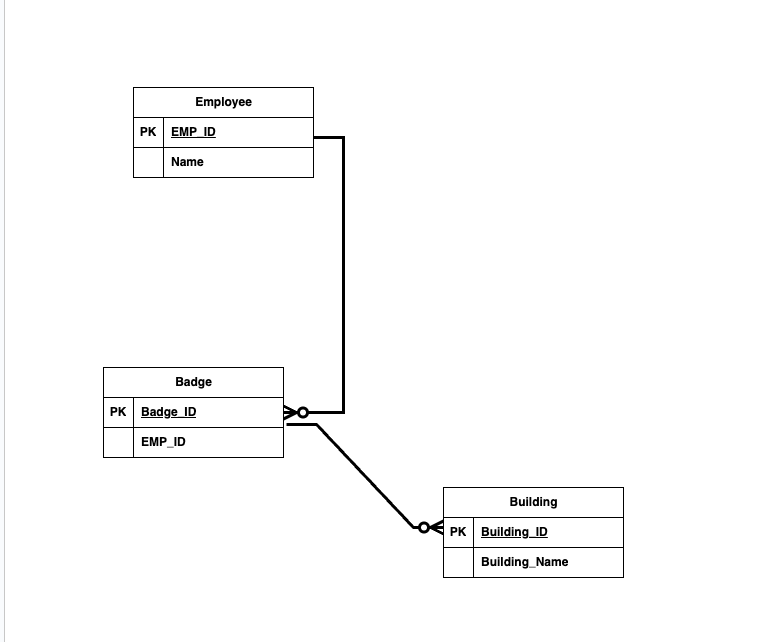

<!-- color: white -->
<!-- The color directive will be inherited
Probably need to learn how to set it globally and override it
locally
 -->
# Eventstore Sample Course

---
<!-- paginate: true -->
<!-- paginate adds slide numbers, we start on the second -->
# Overview

* Doing a Thing
* Doing that other thing
* What it all means

---

# Definitions of Terms

A stream is blah blah blah blah

Immutable, flexible schema, type flag defines contract with application using the stream

---

# A numbered list

1. In your IDE, you will find a code stub that has your write your first event to a stream in EvenstoreDB. 

2. Title of the stream:

3. Use your name as the stream title

---
<!-- backgroundImage: url('./resources/Lab_background.png') -->
<!-- color: black -->
# Lab Instructions
1. Open up your Lab environment
2. Run the test notebook to see that your node environment is functioning
3. Start your docker container running eventstore
4. Open up the stub notebook and follow the isntructions
5. Run the validate notebook to verify you have succeeded

---
<!-- backgroundImage: url('./resources/background.png') -->
<!-- color: white -->
# Let's Review

You need to respecify the background if you change it, otherwise it repeats 

---

# Some Benefits of Event Sourcing

* Audit

Event-source stores data as a series of immutable events over time, providing a strong audit capability out-the-box.

* Root Cause Analysis

Business events are tied back to their original chains of causation, allowing visibility into entire workflows.

---

# Benefits of Event Sourcing continued...

* Time Travel

All state changes are kept, so it is possible to move entire system state backwards in time for debugging and “what-if” analysis.

* Projections

Event streams can (re)played through different fold operations to look at existing data in new and interesting ways.

---

# Including Images

Here is an included image

---
<!-- backgroundImage: url('./resources/Lab_background.png') -->
<!-- color: black -->

# Lab Instructions

1. Open up the folder tited your second stream and follow the instructions
2. If you have issues you can run the test_node.js file
3. When you are done you can run the validate lab script to see if you have succeeded

---
<!-- backgroundImage: url('./resources/background.png') -->
<!-- color: white -->

# We are back to old style

---
<!-- _text-align: center 

-->

# I honestly don't know why this doesn't work

Hello world

---

<!-- Scoped style -->

# Red text centered (only in the current slide page)

---

# Back to normal

---

<!-- Scoped style -->

# Red text centered (only in the current slide page)
---

# Back  to Regular